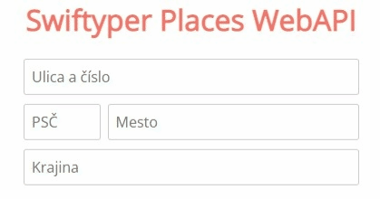
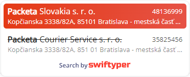
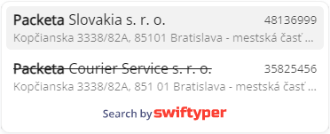
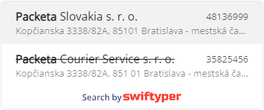

# 🔍 swiftyper.js




## 🔧 Configuration

Register your project on [Swiftyper](https://swiftyper.sk).

## Getting Started

### Installation:

#### CDN

```html
<script src="https://cdn.jsdelivr.net/npm/swiftyper.js@1.0.8"></script>
```

#### Package Manager

-   [npm](https://www.npmjs.com/package/swiftyper.js) install

```shell
npm i swiftyper.js
```

-   [Yarn](https://yarn.pm/swiftyper.js) install

```shell
yarn add swiftyper.js
```

## 📕 API documentation

[API documentation](https://developers.swiftyper.sk/docs/api)

## 🖌 Themes

### Modern (light)


### Modern (dark)


### Classic


## 🧪 Testing

```sh
npm run dev
```
